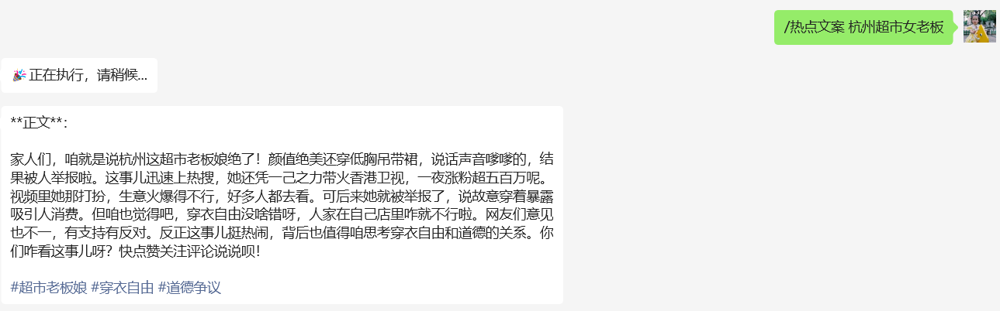

# bot_choice
ChatGPT on WeChat项目插件, 根据提示词调用不同bot/model,可以实现多指令执行

目前bot/model只支持openai接口规范

可以多指令执行 ，比如 /热点文案 /搜图片 杭州超市女老板走红

)
)

config.json 配置说明
```json
{
  "max_words":1000,
 "bot_list":[
    {"url":"http://xxxx/v1","keyword":"/视频文案", "model":"/视频文案","key": "pat_5Dd01WUPwTK4"},
   {"url":"http://xxx/v1","keyword":"/热点文案", "model":"/热点文案","key": "pat_5Dd0BYoD3BmwTK4"},
   {"url":"http://xxxx/v1","keyword":"/搜图片", "model":"/搜图片","key": "pat_5Ddkw0TK4"}
 ],
  "short_help_text": "发送特定指令以调度不同任务的bot！",
  "long_help_text":  "📚 发送关键词执行任务bot！\n🎉 娱乐与资讯：\n🌅 搜图: 发送“/搜图片 xxx”搜索你想要的图片。\n🐟 视频文案: 发送“/视频文案 链接地址”解析视频文案。\n🔥 文章: 发送“/文章 话题”生成爆款文案。\n"
}

```
